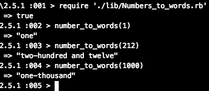

## Numbers_to_words
Numbers to words: write an app that can covert a decimal number between 1 and 1000 into the word that represents the number e.g. 1 becomes "one", 89 becomes "eighty-nine".


## Launch and Test
Run the test
```
$ git clone https://github.com/jeff1108/Number_to_words.rb.git
$ rspec
```
Open irb:
```
irb
require './lib/Numbers_to_words.rb'
```
Type any number between 1 to 1000
```
number_to_words(1)
number_to_words(200)
number_to_words(1000)
```


## Example

